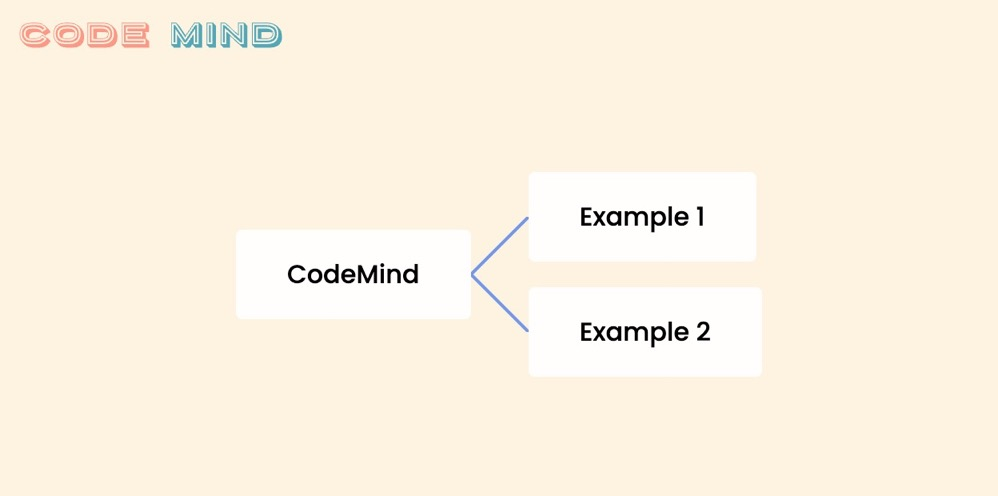

Online mind mapping that supports code writing, single and native.

## Why
Xmind is the best mind mapping tool I have used, but it tends to freeze after working with hundreds of nodes. Additionally, I want to be able to write code with highlights within a mind map.

## To Do
- [x]  Background
- [x]  Scalable and movable
- [x]  Generate child nodes and sibling nodes
- [x]  Connection lines
- [x]  Styles are managed through context
- [x]  Fixed connection line 01
- [x]  Focus on newly generated node
- [ ]  More connection line styles
- [x]  Editable content
- [ ]  Deletion
- [ ]  Control
- [ ]  Transition
- [ ]  Mobile frendly
- [ ]  Draggable
- [ ]  Save feature
- [ ]  Restyle
- [ ]  Monaco
- [ ]  AI?