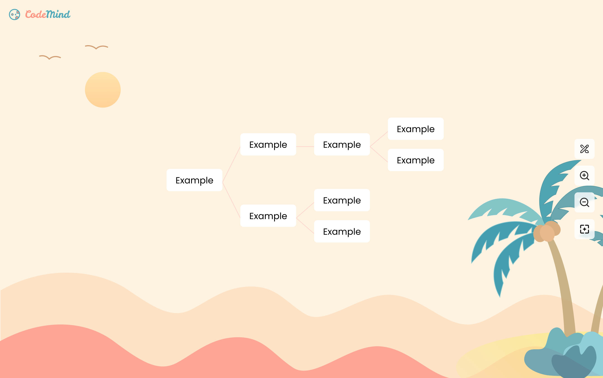

Online mind mapping that supports code writing, single and native.

## Start

type `/code` to switch to code node (ts)

## Why

Xmind is the best mind mapping tool I have used, but it tends to freeze after working with hundreds of nodes. Additionally, I want to be able to write code with highlights within a mind map.

## To Do

- [x] Background
- [x] Scalable and movable
- [x] Generate child nodes and sibling nodes
- [x] Connection lines
- [x] Styles are managed through context
- [x] Fixed connection line 01
- [x] Focus on newly generated node
- [x] More connection line styles
  - bezier
  - right-angle
  - straight-with-handle
  - straight
- [x] Optimise writing node
- [x] Editable content
- [x] Deletion
- [x] Code(Monaco)
- [x] Mouse/Touchpad, Window/Macbook (Figma-like control)
  - [ ] Point Zoom
- Transition
  - [x] Scale
- [x] Save feature
- [ ] Resize node
- [ ] Control panel
- [ ] Export/Import
- [ ] Undo/Redo
- [ ] Box selection
- [ ] Draggable
- [ ] Restyle
- [ ] AI?
- [ ] Markdown
- [ ] Mobile frendly
- [ ] Control
